# rocom-go

《洛克王国：世界》的**游戏数据分析工具**：在 Linux 网关上被动抓取手机游戏的 TCP 流量，
解析其私有协议，把宠物、精灵蛋、培育、远行商人、地图、试炼等数据做成一个响应式 Web 面板。

**不读内存、不注入进程、不改客户端** —— 它只看网络包，本质上是一个懂这套协议的分析器。

> ⚠️ 公开分发前请先读[免责声明](#免责声明)：本项目涉及第三方游戏的私有协议与客户端素材。

## 界面

| 宠物列表 | 精灵蛋仓库 |
| --- | --- |
| 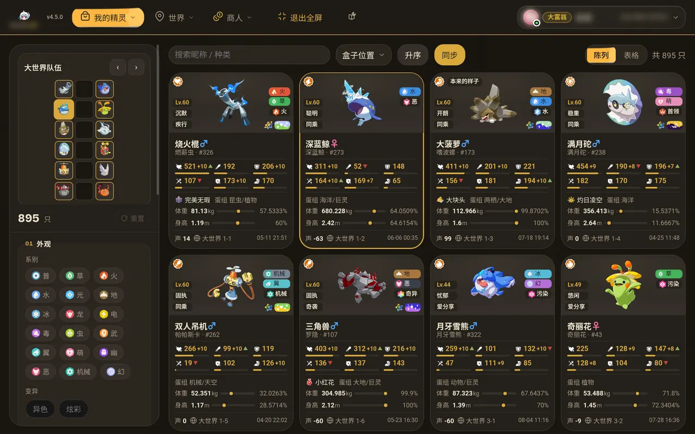 | 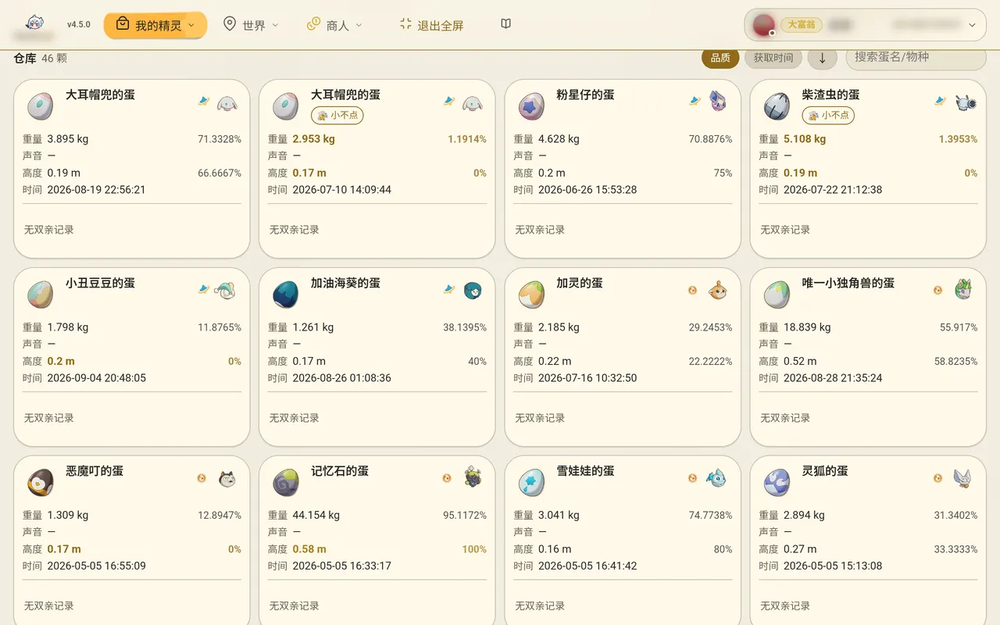 |

| 培育追踪 | 远行商人 |
| --- | --- |
| 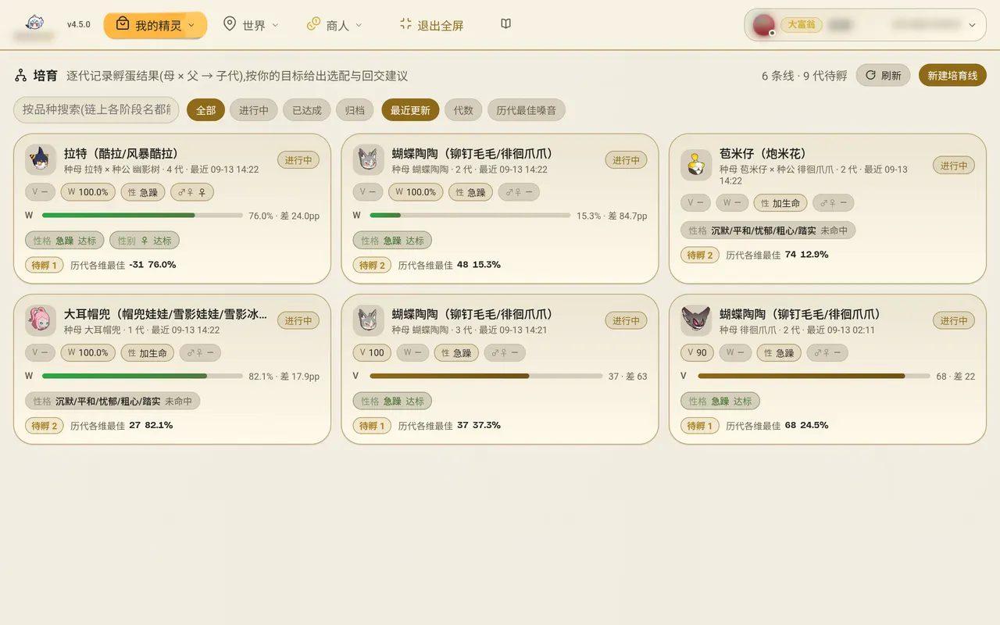 | 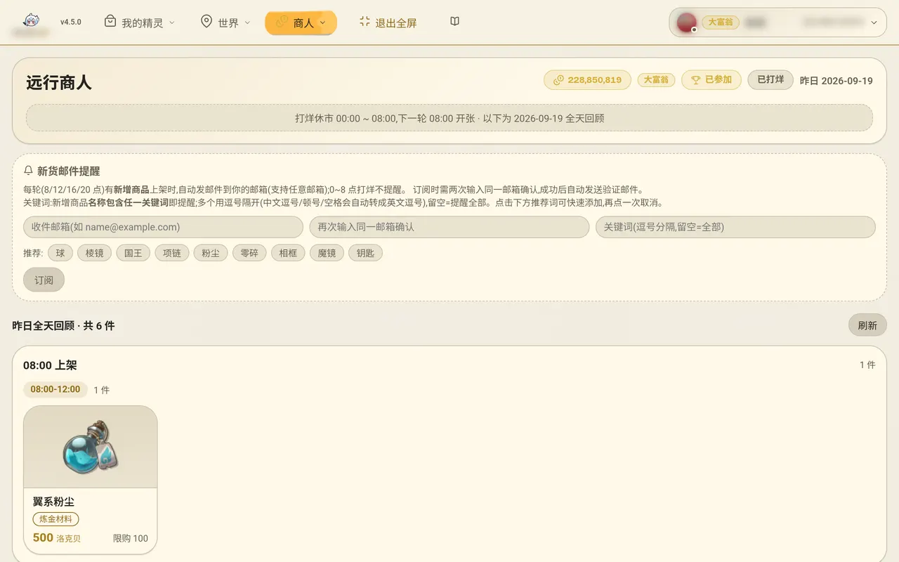 |

| 实时地图 | 草系试炼 |
| --- | --- |
| 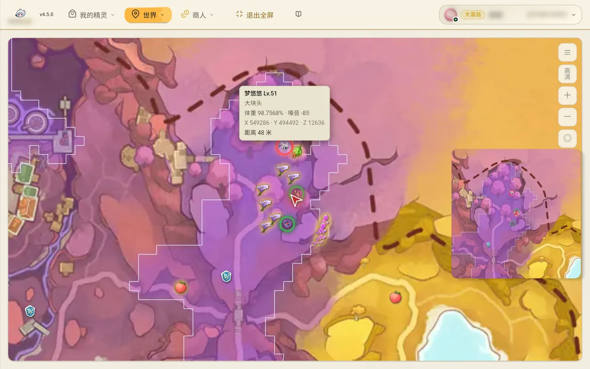 | 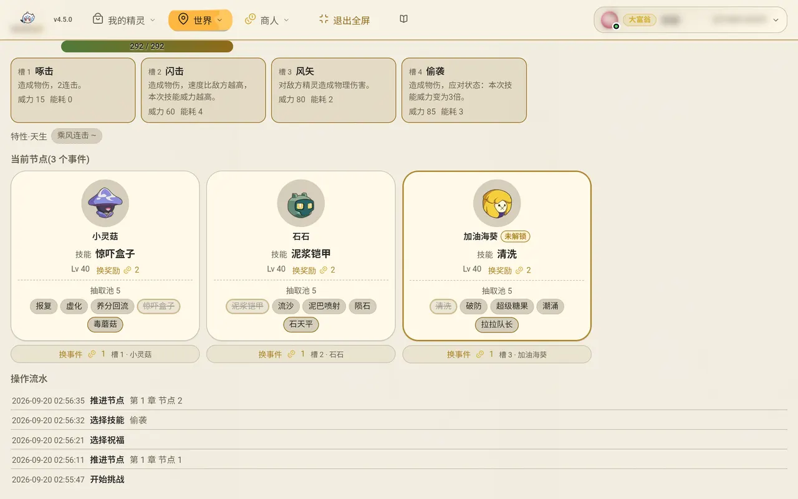 |

手机端是同一套前端，竖屏下换成底部导航（我的精灵 / 世界 / 商人）：

| 宠物列表 | 家园查询 | 炫彩图鉴 |
| --- | --- | --- |
| 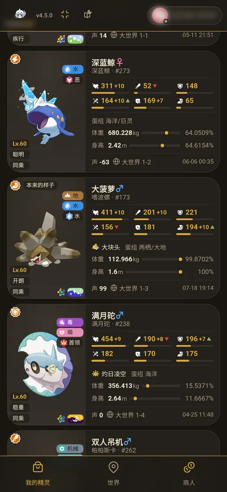 | 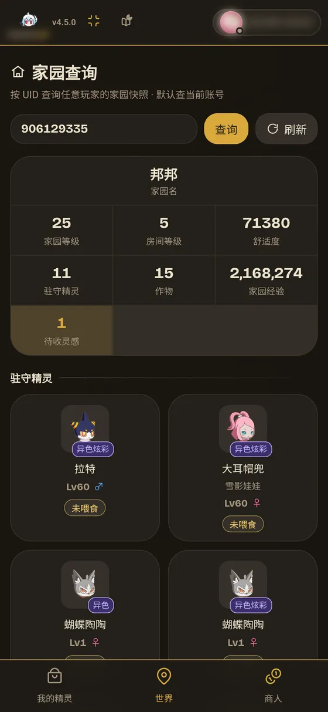 | 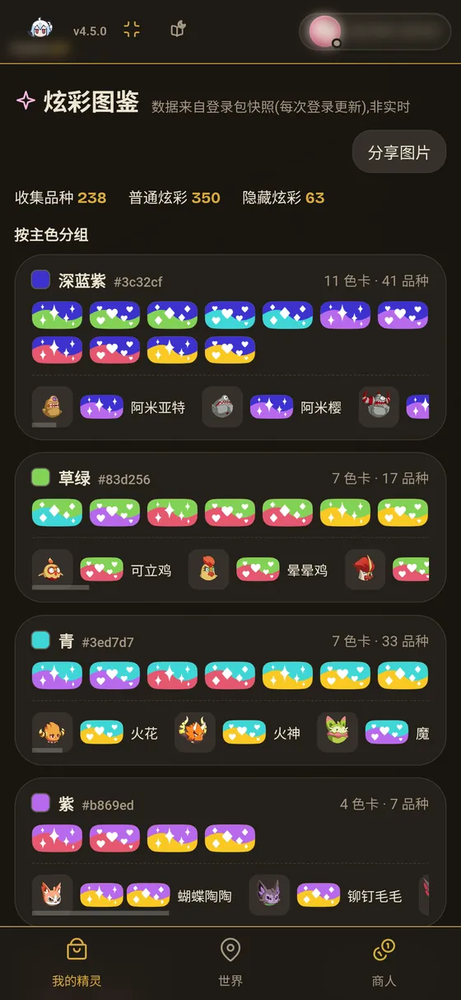 |

## 主要功能

### 宠物与仓库

解析 `PetData`，把每只宠物的**个体值、性格、特性、血脉、异色炫彩、体型百分位**都摊在卡片上：
一眼看出谁是大块头、谁玩心高、谁值得练。支持按属性 / 特性 / 体型 / 稀有度组合筛选，
四百多个维度排序（大小、玩心、个体值总和……），历史变更可回溯。

- **大世界队伍**与**盒子排布**分开呈现，抓到的宠物自动归位
- 筛选态、排序态、主题（浅色 / 深色 / 图鉴皮肤）都存在本地，换设备不丢
- 表格视图给需要横向对比的人；卡面视图给日常翻看

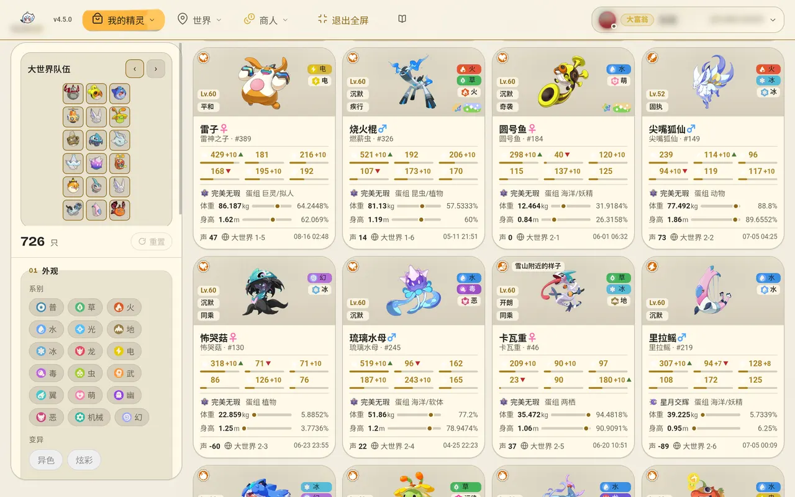

### 精灵蛋与孵化

孵蛋记录与孵化速率统计。**「猜猜孵出谁」**用本地解包配置，按蛋的**尺寸 + 孵化时长**
反推候选物种并给出匹配度 —— 不用等孵化，开蛋前就知道大概是谁。

每颗蛋记录重量、声音、高度、获得时间与来源，可回溯到是哪只母宠生的。

### 培育追踪

记录**母 × 父 → 子代**的完整链条，按你设的目标（性格 / 特性 / 个体值）给出适配度与**回交建议**：
这条线的后代离目标还有多远、该和哪只回交、历代最佳是多少。

支持多条培育线并行，每条线独立追踪代际与最佳记录。

### 远行商人

8 / 12 / 16 / 20 四轮货单，按 4 小时槽缓存，昨日全天回购。**支持关键词邮件订阅提醒**：
新货上架时自动发信到你的邮箱，关键词可用「逗号 = 或、空格 = 且」组合，
中文标签会自动转成对应的英文名 —— 不用守着刷新。

### 实时地图

从流量里还原**角色位置、朝向、场景层**，叠加大地图瓦片（含可选高清层），
把**野生宠物**按实时坐标画成标记：

- 悬停看资料卡：等级、体型百分位、噪音值、精确坐标、离你多远
- **体型 / 声音筛选**：只标出「大块头且噪音低」的那几只，找闪光宠时省一半路
- **涂地覆盖**：走过哪里涂到哪里，一眼看出还没刷新的区域
- **稀有出现提醒**：把稀有宠的出现推到你面前

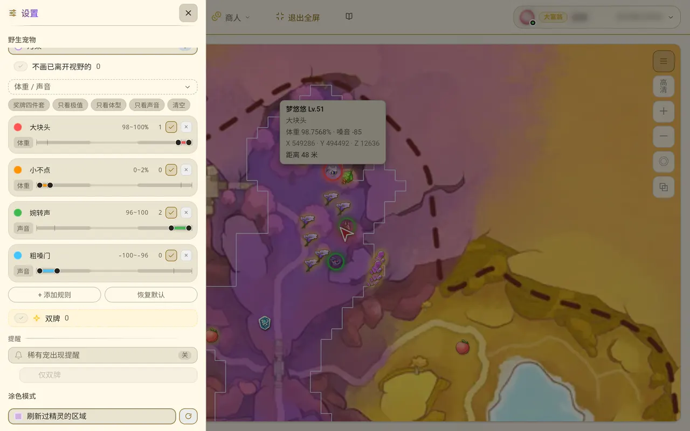

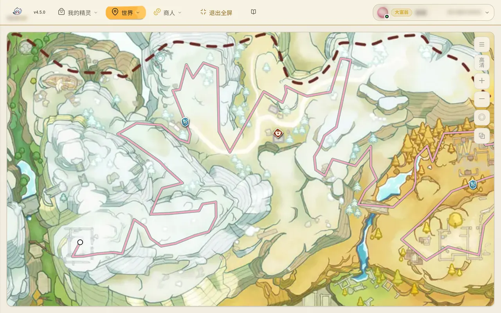

**采集路线追踪**：跟着角色走，走过的区域实时上色 —— 回看时能完整复现这一趟的路线，
哪片刷过、哪片还没去过一目了然。

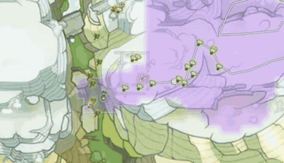

### 图鉴与炫彩

39 组配色 + 粒子素材合成的炫彩渲染，与游戏内表现对齐（普通炫彩按素材 alpha 蒙版三层填色，
隐藏炫彩直接引用整图）。

图鉴按**主色分组**（深蓝紫 / 草绿 / 青 / 紫……），每组列出该色系的全部色卡与本组拥有的品种，
顶部给出「收集品种 / 普通炫彩 / 隐藏炫彩」三个计数 —— 哪个色系还缺一目了然，也可导出成图片分享。
数据来自登录包快照（每次登录更新，非实时）。

### 家园查询

按 UID 查询**任意玩家**的家园快照：家园等级、房间等级、舒适度、家园经验、作物，以及**待收灵感**
（到点可收的高亮显示）与驻守精灵列表（带异色 / 异色炫彩标记）。

与「实时地图」里的家园小窝是两回事，别混：那个来自抓包，只有**你自己**的家园；这个回源第三方，
**谁都能查**，与抓包无关。登录后会自动预热当前账号那一份，所以点进去通常直接有数据；结果缓存
15 分钟，可手动强制刷新。

### 草系试炼

层结构、各章精灵池、22 名首领阵容、NPC 阵容。战斗中的**抽取 5 选、事件选择、操作流水**
都被记录下来，便于复盘哪一步选错。

### 手机端代理与一键导入

云端模式下内置 **hysteria2** 代理（UDP），手机把游戏流量送过来，本机整网卡抓包即可见。
面板里给每个设备发一条**独立订阅链接**：

- **一键导入**：扫码或点链接直接进客户端，不用手填密码、端口和分流规则
- **短链 + 二维码 + 引导页**：给的是 `…/i/<短码>`，打开是引导页（二维码 + 一键按钮 + 三步说明）
- **一人一枚令牌**：谁不玩了单独吊销，不影响其他人；误点可恢复
- **格式自动识别**：Clash YAML / 小火箭 `.conf`，按 `?format=` → 路径后缀 → UA → `Accept` 依次判定

> 订阅下发的是**整份配置**（节点 + 分流规则），不是一条 node 链接 —— 抓包成立的前提是
> 游戏那条 TCP 流量被送进代理，而规则塞不进 node 链接里。只导入节点会得到
> 「手机连上了、游戏也能玩、面板上一条数据都没有」且极难自查的结果。

### 多账号与实时推送

局域网多台设备同时在线，数据按登录 `user_id` 隔离，切账号需 PIN。
前端经 **SSE** 增量更新、断线自动补拉；手机页支持「屏幕常亮」（需 HTTPS 上下文）。

### 管理面板

隐式入口 `#/admin`（导航不显示）：黑白名单规则、订阅设备与邮箱名单、游玩记录、
容器 / 宠物投放、代理与 Web 监听地址的**热更**（改密码、白名单、端口都不打断正在进行的抓包）。

### 离线回放

`-pcap <文件>` 直接分析已抓好的包，设备不必在线。
`go run ./cmd/pcapdump -pcap <文件>` 把回放转成适合阅读的结构化文本（opcode 概览 / 按 opcode 转储 / 按宠物编号扫描），
调试新协议时不必临时写一次性程序。

## 快速开始

需要 root（afpacket 原始套接字）。完整的环境准备、cgo 注意事项、systemd 与 Docker 部署
见 [docs/deploy.md](docs/deploy.md)。

```bash
go build -o rocom-go ./cmd/rocom-go     # 前端产物已随仓库提交，可直接编译
sudo ./rocom-go -iface auto             # auto = 自动选默认路由所在的网卡
```

打开 <http://localhost:4939>。**先启动本工具**（要抓到密钥协商包），再进游戏
**打开一次宠物仓库**触发宠物列表下发。会话密钥会随连接落库，服务重启后对仍存活的
连接自动恢复密钥继续解析（有效期 24h），无需重登游戏重新协商。

两种典型部署：

| 方式 | 适用 | 关键参数 |
| --- | --- | --- |
| **局域网网关** | 软路由 / 旁路由 / 开热点的机器，手机流量必经它 | `-iface <网卡>` |
| **云端代理** | 有公网 IP 的 VPS，手机用 Clash 把游戏流量代理过来 | 再加 `-skip-self-ip=false -tls` |

```bash
# 云端模式的完整形态(代理是内嵌的 hysteria2,走 UDP)
sudo ./rocom-go -iface auto -hy2-addr :11443 -skip-self-ip=false \
  -hy2-allow <手机公网IP> -hy2-pass <强密码> -tls
```

> 云端模式**必须**设 `-hy2-allow` 白名单：密码挡得住「连进来」，挡不住扫描器把 UDP 端口打满
> 或拿它当跳板，耗尽 fd / goroutine 会连同进程的 Web 服务一起拖垮。
>
> 三点容易踩的：**①** 防火墙与云安全组放行的是 **UDP** 11443，不是 TCP；
> **②** 手机端须用支持 hysteria2 的客户端（Clash Meta / 小火箭 / sing-box），
> `deploy/rocom-clash.yaml` 有一份可直接导入的配置；**③** 证书复用 Web 那份自签证书，
> 客户端记得 `skip-cert-verify: true`。
>
> 换 hysteria2 而不是 SOCKS5 的理由见 [internal/hy2](internal/hy2/server.go) 的包注释：
> 公网上的 SOCKS5 明文认证与开放代理特征无法靠配置弥补。抓包侧则完全不变 ——
> 流量到本机后仍以本机 IP 出站，`-skip-self-ip=false` 照旧。

> **客户端要开 TUN 模式、规则分流。** 游戏用的是原生 TCP socket，**不走系统代理**，
> 只有 TUN 才拦得到；选「全局」会把你所有流量绕去 VPS（这台机器是抓包机，不是日常出口），
> 选「直连」等于白连。导入后确认「抓包通道」策略组选中的是节点而不是 DIRECT。

## 架构

```
afpacket/pcap → TCP 重组 → GCP 分帧 → 0x1002 取密钥 → 0x4013 AES-CBC 解密
  → opcode 路由 → PetData(protobuf) → 名称本地化 → SQLite → REST/SSE → React 前端
```

Go 后端 + React 前端，构建为**单个二进制**（前端经 `embed` 内嵌）；SQLite 单文件存全部数据。

| 目录 | 说明 |
| --- | --- |
| `internal/capture` | afpacket 实时抓包 / pcap 离线回放 + TCP 重组 |
| `internal/gcp` | GCP 分帧、密钥提取、AES 解密 |
| `internal/pb` `internal/pbdesc` | 由游戏描述符生成的消息结构、opcode → 消息名映射 |
| `internal/pet` `internal/scene` `internal/trial` | 领域解析：宠物 / 场景与实体 / 试炼 |
| `internal/gamedata` | id → 中文名查找表、图标与地图投影（生成物，内嵌） |
| `internal/pipeline` | 消息分发与落库 |
| `internal/store` | SQLite 存储与筛选查询 |
| `internal/server` | REST + SSE + 内嵌前端 + 配置订阅（短链 / 二维码 / 引导页） |
| `internal/hy2` | 内嵌 hysteria2 代理（云端模式，UDP），支持运行期改配置而不打断抓包 |
| `internal/dialout` | 代理出站侧的共用能力：白名单、DNS 缓存、happy-eyeballs 拨号 |
| `web` | React + Vite 前端 |
| `scripts` | 解包与代码生成、抓包、契约校验脚本 |

## 开发

```bash
cd web && npm install
npm run dev         # Vite 开发服务器，已配 /api 与 /img 代理到后端 4939
npm run build       # 构建到 internal/server/web/（内嵌产物）
npm run lint && npm run check:css && npm run verify    # jsdom 真实渲染验收
cd .. && go vet ./... && go test ./...
```

两条最容易踩的：

1. **`npm run build` 必须在 `go build` 之前。** `//go:embed` 对残缺或过期的资源目录**不报错**，
   顺序反了会编出一个能正常启动、但打开白屏的二进制。
2. **`CGO_ENABLED=0` 编不出能抓包的二进制。** `gopacket/afpacket` 靠 cgo 实现，缺 gcc 时 Go 会
   静默降级，报错却是一个看似无关的 `undefined: pageSize`，极易误判成依赖版本问题。
   自检：`go list -f '{{.IgnoredGoFiles}}' github.com/google/gopacket/afpacket`。

生成物（`internal/pb/*.pb.go`、`names.json`、`internal/pbdesc/data/*`）请改生成脚本而非手改。
重构后跑 `python3 scripts/check_refactor.py` —— 它回答的是「有没有**未登记**的改动」，
比 `go build` 多查注释归属与净内容守恒。

## 文档

| | |
| --- | --- |
| [docs/deploy.md](docs/deploy.md) | 环境准备、构建、运行、`-skip-self-ip` 判据表、systemd / Docker、订阅与客户端配置 |
| [docs/protocol.md](docs/protocol.md) | tsf4g / GCP 字节布局、分帧、密钥与解密、opcode |
| [docs/protocol-0x0102-login.md](docs/protocol-0x0102-login.md) | 登录报文逐字段拆解 |
| [docs/data.md](docs/data.md) | 解包数据源、生成链、各业务字段的实测依据 |
| [docs/architecture.md](docs/architecture.md) | 数据流、模块划分、HTTP 接口、前端 |
| [docs/api/](docs/api/README.md) | 对外 HTTP 契约（含机器可读的 `fields.json`） |
| [docs/unpack-2026-09.md](docs/unpack-2026-09.md) | 新加密方案下的解包步骤与诊断 |
| [docs/reference.md](docs/reference.md) | 相关工具与开源项目 |

版本号唯一真源是 [`VERSION`](VERSION)，格式 `赛季.大更新.小更新`。

## 免责声明

使用与再分发前，请确认你能接受以下全部几点：

1. **这可能违反游戏的服务条款。** 逆向私有协议、抓取游戏数据属于多数网游 ToS 中的禁止行为。
   由此导致的**账号封禁或其他后果由使用者自行承担**，作者不提供任何豁免或支持。
2. **本仓库内嵌了第三方素材与数据。** `internal/gamedata/data/` 下的图片与名称表由游戏客户端
   资源包解包生成，**版权归游戏方所有**；随仓库分发这些文件未必构成合法的再分发。
3. **手机流量会经过部署它的机器。** 云端 hysteria2 代理模式下确实如此 —— 请把这台风控视为你需要
   负责的网络出口，并务必配置白名单与认证。发给别人的订阅链接等同于交出节点密码，一对一发。
4. 本项目按「现状」提供，**不含任何明示或暗示的保证**。

## 上游与致谢

- **早期版本来自 [@whoisnian](https://github.com/whoisnian)**：本仓库最早的 168 条提交
  （2026-06-27 ~ 2026-08-19）来自其早期版本，本项目在其之上继续开发；
  这些提交的作者信息按原样保留，未作改写。

## 许可

**代码与文档采用 [GNU GPL v3.0](LICENSE)。** 再分发（含衍生作品）须同样以 GPL-3.0 开源并提供源码。

**明确排除**：`internal/gamedata/data/` 下的图片、名称表与大地图瓦片由游戏客户端资源包解包生成，
**版权归游戏方所有**，不属本许可证的授权范围 —— 本仓库无权授权他人再分发它们，
随仓库分发这些文件本身也未必构成合法的再分发（另见下方免责声明第 2 点）。
